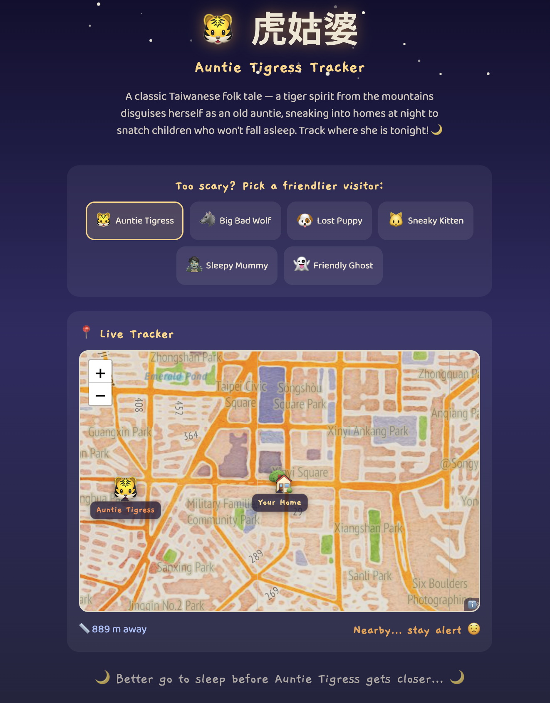

# 🐯 虎姑婆 — Auntie Tigress Tracker

> *"Go to sleep, or Auntie Tigress will come for you…"*

A cute, interactive web app inspired by the classic Taiwanese folk tale **虎姑婆** — a tiger spirit from the mountains who disguises herself as an old auntie, sneaking into homes at night to snatch children who won't fall asleep.

Watch in real-time as Auntie Tigress slowly creeps toward your home on a watercolor map. Will you fall asleep in time? 🌙

## ✨ Features

- 🗺️ Interactive watercolor map (Leaflet + Stamen tiles) with zoom & pan
- 📍 Uses your real location (or defaults to Taipei)
- 🐯 Auntie Tigress slowly spirals toward your home
- 🐶 Too scary? Swap her for a puppy, kitten, wolf, ghost, or mummy
- 📏 Live distance tracker with danger level warnings
- ⭐ Twinkling night sky with animated starfield
- 📱 Mobile-friendly

## 🖼️ Preview

```
┌──────────────────────────────────┐
│     ⭐        ⭐    ⭐          │
│  🐯 虎姑婆                      │
│  Auntie Tigress Tracker          │
│                                  │
│  [🐯] [🐺] [🐶] [🐱] [🧟] [👻] │
│                                  │
│  ┌────────────────────────────┐  │
│  │ 🏡          🐯             │  │
│  │    ~ watercolor map ~      │  │
│  │       zoom in/out 🔍       │  │
│  └────────────────────────────┘  │
│  📏 847 m away    Nearby… 😟    │
│                                  │
│  🌙 Better go to sleep… 🌙      │
└──────────────────────────────────┘
```


## 🚀 Getting Started

```bash
npm install
npm run dev
```

Allow location access for the full experience!


## 🛠️ Built With

- [Vue 3](https://vuejs.org/) — Composition API + `<script setup>`
- [Leaflet](https://leafletjs.com/) — Interactive maps
- [Stamen Watercolor](https://maps.stamen.com/) — Hand-painted map tiles
- [Vite](https://vite.dev/) — Build tool
- [Kiro](https://kiro.dev) — AI-assisted development

## 📁 Structure

```
src/
├── App.vue
├── components/
│   ├── StoryHeader.vue      ← Night sky + story intro
│   ├── IconPicker.vue       ← Creature selector
│   └── CreatureMap.vue      ← Leaflet map with live tracking
└── composables/
    ├── useGeolocation.js    ← Browser location API
    └── useCreatureTracker.js ← Creature movement logic
```

---

*Developed with 🐯 and [Kiro](https://kiro.dev). No children were eaten in the making of this app.*
